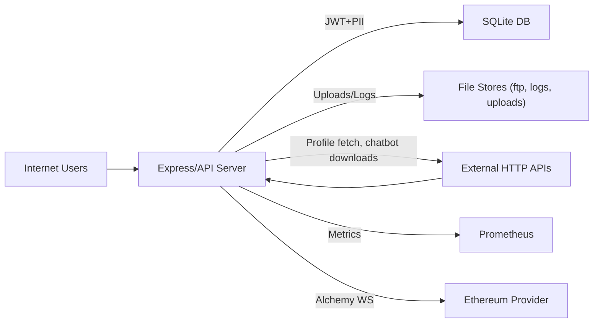

## Context

While exploring OpenAI's Codex I noticed an interesting skill called "Security Threat Model". 


Skills can be thought about as: A packaged set of instructions + tools that teach the AI how to do a task. The structure below is what a skill looks like practically.

```bash
skill-name/
 ├─ skill.md        (instructions for the AI)
 ├─ scripts/        (optional code)
 ├─ resources/      (checklists, templates)
 └─ metadata.json
```

While the skill itself has prompting that would satisfy a threat model, I used this for my testing purposes.

```text
Use the security-threat-model skill on this repository.

Steps:
1. Infer system architecture from code and configuration.
2. Identify system components, services, and dependencies.
3. Generate a Mermaid data flow diagram.
4. Identify trust boundaries and sensitive assets.
5. Enumerate entry points and untrusted inputs.
6. Produce a STRIDE threat model mapped to components and data flows.
7. Recommend mitigations.

Focus on:
- authentication
- secrets management
- data exposure
- injection risks
- third-party integrations.
```

## Quick Test

For a quick test I decided on using the popular OWASP Juice Shop as a codebase for the
skill to assess. While using the desktop version of codex for my initial test, I decided to use the CLI version for this blog entry to see if there were any noticeable difference in the outcomes.


The prompted desktop codex version seemed more detailed, netherless it still produced a detailed threat-model.


<details>


## Executive summary

OWASP Juice Shop exposes a monolithic Node/Express API (`/Users/nick/Documents/Technology/projects/codex-owasp_juiceshop/juice-shop/server.ts`) plus an Angular SPA to the public internet with numerous intentionally vulnerable routes. Top risk themes are (1) weak or bypassable authentication/2FA and hard-coded secrets (`lib/insecurity.ts`, `routes/2fa.ts`), (2) unauthenticated access to sensitive files/logs/metrics (`routes/fileServer.ts`, `routes/logfileServer.ts`, `routes/metrics.ts`), (3) SQL/SSRF/file-processing injections across search, login, upload, and profile-image workflows, and (4) exposure of third-party keys (Google OAuth, Alchemy WebSocket) that grant attackers leverage beyond the app itself. Customer PII and stored cards in SQLite plus blockchain wallet integrations make these issues high impact.

## Scope and assumptions
- **In-scope paths:** `/Users/nick/Documents/Technology/projects/codex-owasp_juiceshop/juice-shop/server.ts`, `routes/**`, `lib/**`, `models/**`, `config/default.yml`, `frontend/**` runtime build, `data/**` (SQLite + chatbot data), `encryptionkeys/**`, `uploads/**`.
- **Out-of-scope:** `cypress/**`, `test/**`, CI configs, translation files (per Crowdin rule), `rsn/**`.
- **Assumptions:** Public internet exposure on TCP 3000 without upstream WAF; SQLite persists customer PII/payment data (`models/index.ts`, `routes/payment.ts`); Google OAuth client ID and Ethereum provider key in repo remain valid in prod; no additional secrets vault beyond `config/*.yml`; Prometheus `/metrics` lacks auth; uploads stored on shared disk accessible via `frontend/dist/frontend/assets/public/images/uploads/`.
- **Open questions:** (1) Is there any production reverse proxy enforcing TLS/client certs? (2) Are Prometheus metrics/log files reachable only from internal IPs despite public server? (3) Is the Ethereum WebSocket key rate-limited or monitored for abuse?

## System model
### Primary components
1. **Public SPA + Express API** – Single Node process (`server.ts`) hosting REST/GraphQL-like routes, static Angular assets (`frontend/dist`). Uses Sequelize/SQLite (`models/index.ts`) and in-memory challenge state.
2. **SQLite data store** – File `data/juiceshop.sqlite` storing users, cards, orders, wallets, PII.
3. **File stores** – `ftp/`, `logs/`, `uploads/complaints/`, `frontend/dist/.../uploads/` served directly by routes (`routes/fileServer.ts`, `routes/logfileServer.ts`, `routes/profileImageUrlUpload.ts`).
4. **Third-party integrations** – Google OAuth (`config/default.yml`), Alchemy Ethereum WebSocket (`routes/web3Wallet.ts`), external fetches (profile image SSRF, chatbot download in `routes/chatbot.ts`), Prometheus scraping (`routes/metrics.ts`).

### Data flows and trust boundaries
- Internet clients → Express server (HTTPS assumed via reverse proxy)
  • Data: credentials, JWTs, payments, uploads.
  • Channel: HTTP/REST + WebSocket.
  • Security: JWT (`lib/insecurity.ts`) with 6h lifetime; optional TOTP via `/2fa`.
  • Validation: limited—raw SQL strings in `routes/login.ts`/`routes/search.ts`, permissive file filters.
- Express server → SQLite (`models/index.ts`)
  • Data: user rows, cards, wallets.
  • Channel: local file DB.
  • Security: no encryption-at-rest, DB creds hard-coded.
  • Validation: minimal ORM; some raw queries.
- Express server → File systems (`ftp/`, `logs/`, `uploads/complaints/`, `frontend/dist/.../uploads/`)
  • Data: complaints, profile images, keys/logs delivered to clients.
  • Channel: local FS; HTTP sendFile.
  • Security: path checks only block `/`; null-byte trimmed but still relative paths.
- Express server → External services (Google OAuth, download SSRF, Alchemy WebSocket, fetch profile images)
  • Data: OAuth tokens, blockchain wallet addresses, arbitrary URLs.
  • Channel: HTTPS/websocket.
  • Security: trusts remote SSL; no outbound egress filtering.
- Prometheus scrapers → `/metrics`
  • Data: challenge counts, user stats, wallet totals.
  • Channel: HTTP; no auth controls besides UA allowlist.

#### Diagram


## Assets and security objectives
| Asset | Why it matters | Security objective (C/I/A) |
| --- | --- | --- |
| Customer accounts & credentials (`data/juiceshop.sqlite`, `/routes/login.ts`) | Drive authentication, TOTP secrets, challenge progress | C/I |
| Stored payment cards (`routes/payment.ts`, `models/card.ts`) | PCI-like data, even masked | C |
| JWT signing key & RSA private key (`lib/insecurity.ts`, `encryptionkeys/`) | Enables token minting, auth bypass | C/I |
| OAuth & blockchain API keys (`config/default.yml`, `routes/web3Wallet.ts`) | Permit abuse of Google auth redirect and Alchemy plan | C/A |
| Uploaded files & complaints (`uploads/complaints/`, `routes/fileUpload.ts`) | Could contain sensitive attachments or malware | C/I |
| Logs/metrics (`routes/logfileServer.ts`, `routes/metrics.ts`) | Leak operational data, user counts | C |
| Wallet balances (`routes/wallet.ts`) | Digital value inside app | C/I |
| Application availability (`server.ts`, `routes/**`) | Training/production service uptime | A |

## Attacker model
### Capabilities
- Remote anonymous internet clients hitting any exposed route over HTTP(S).
- Ability to craft arbitrary HTTP requests, cookies, JWTs, file uploads, and SSRF target URLs.
- Access to leaked config/API keys embedded in repository build artifacts.
- Observe responses from metrics/logfile endpoints if no additional middleware is configured.

### Non-capabilities
- No shell or filesystem access beyond exposed HTTP routes.
- Cannot directly modify server-side config files or redeploy code.
- Cannot intercept traffic inside internal network once inside server (assumes TLS terminates before Express).

## Entry points and attack surfaces
| Surface | How reached | Trust boundary | Notes | Evidence |
| --- | --- | --- | --- | --- |
| `/rest/user/login` form (`routes/login.ts`) | JSON POST from SPA/public | Internet → API | Raw string SQL; MD5 password hash; seeds tokens | `/Users/nick/.../routes/login.ts` |
| `/rest/products/search` (`routes/search.ts`) | Query `q` param | Internet → API | UNION-friendly SQL string; reveals schema/PII | `/Users/nick/.../routes/search.ts` |
| File uploads (`routes/fileUpload.ts`, `routes/profileImageUrlUpload.ts`) | Multipart uploads / remote URL fetch | Internet → API & API → FS/external | Zip/XML/YAML parsing, SSRF to arbitrary URLs | `/Users/nick/.../routes/fileUpload.ts`, `/Users/nick/.../routes/profileImageUrlUpload.ts` |
| `/metrics` (`routes/metrics.ts`) | GET by Prometheus or attacker | Internet → API | Only UA filtering; leaks challenge/user/card stats | `/Users/nick/.../routes/metrics.ts` |
| `/ftp/:file`, `/logs/:file`, `/encryptionkeys/:file` | Direct GET | Internet → File stores | Minimal validation, exposes backups/logs/keys | `/Users/nick/.../routes/fileServer.ts`, `/Users/nick/.../routes/logfileServer.ts`, `/Users/nick/.../routes/keyServer.ts` |
| `/api/chatbot`, `/rest/memory` | Authenticated requests but JWT easily stolen | Internet → API | Chatbot evals training data; memory upload saves paths | `/Users/nick/.../routes/chatbot.ts`, `/Users/nick/.../routes/memory.ts` |
| `/rest/wallet/balance`, `/rest/deluxe` | JWT-protected but tokens forged via private key leak | Internet → API → SQLite | Access wallet funds/deluxe features | `/Users/nick/.../routes/wallet.ts`, `/Users/nick/.../lib/insecurity.ts` |
| `/rest/web3-wallet/listener` | POST wallet address | Internet → External WS | Spins up WebSocket using hard-coded Alchemy key | `/Users/nick/.../routes/web3Wallet.ts` |

## Top abuse paths
1. **Token forgery for privilege escalation**  
   Attacker downloads `/encryptionkeys/jwt.pub` or reads `lib/insecurity.ts` to obtain RSA private key → forges JWT claiming admin role → calls privileged routes (e.g., `/rest/admin` equivalents) → modifies products or exfiltrates data.
2. **SQL injection data dump**  
   POST `/rest/user/login` or `/rest/products/search?q=' OR 1=1--` → raw query concatenation dumps entire `Users` table → attacker harvests hashed passwords, TOTP secrets, PII.
3. **SSRF to internal metadata**  
   Authenticated user sets profile image URL to `http://169.254.169.254/latest/meta-data/...` via `/profile-image/url` → server fetches internal resource, stores response as profile image, exposing cloud metadata or credentials.
4. **Malicious ZIP/XML upload leading to file overwrite**  
   Upload crafted ZIP via complaints endpoint → unzipper writes into `ftp/` or server root due to insufficient path sanitization → attacker plants script served by fileServer (e.g., `ftp/payload.md`) to chain attacks.
5. **Metrics/log leakage for recon**  
   GET `/metrics` and `/logs/<file>` anonymously → glean deployment version, user counts, challenge progress, request errors → craft targeted attacks, harvest PII in logs.
6. **Abuse of third-party keys**  
   Extract Google OAuth client ID proxies and Alchemy WebSocket API key from repo → register malicious OAuth redirect or drain WebSocket quota → cause auth flow compromise or DoS.

## Threat model table
| Threat ID | Threat source | Prerequisites | Threat action | Impact | Impacted assets | Existing controls | Gaps | Recommended mitigations | Detection ideas | Likelihood | Impact severity | Priority |
| --- | --- | --- | --- | --- | --- | --- | --- | --- | --- | --- | --- | --- |
| TM-001 | Spoofing | Access to repo or `/encryptionkeys/` | Forge JWT with exposed RSA private key | Admin takeover, privilege abuse | JWT key, accounts, wallets | Helmet headers, token expiration (`lib/insecurity.ts`) | Private key hard-coded and downloadable, no key rotation | Load RSA keys from secrets manager/ENV, restrict `/encryptionkeys` route, rotate key, enforce short JWT TTL | Alert on admin actions without recent login, monitor unusual token issuers | High | High | Critical |
| TM-002 | Information disclosure | Public access to `/metrics`, `/logs`, `/ftp` | Issue GET requests | Leak PII/logs/metrics/backups | Logs, PII, cards, secrets | Path slash check (`routes/fileServer.ts`), UA block list for Prometheus | No auth, poison-null-byte bypass possible, metrics include counts of users/cards | Require auth on file/log endpoints, serve via authenticated admin UI, scrub sensitive metrics | Monitor for unusual download volume, log file names served | High | Medium | High |
| TM-003 | Tampering | Valid JWT (can be forged) | POST to profile image URL with arbitrary target | SSRF fetch of internal URLs, potential overwrite | Cloud metadata, internal services | Null-byte trimming, extension enforcement fallback (`routes/profileImageUrlUpload.ts`) | Accepts any URL, stores response, catches errors but still writes | Restrict to validated allowlist or signed CDN, perform DNS/IP egress filtering, proxy fetcher with metadata block | Alert on private IP targets, log outbound fetch domains | Medium | High | High |
| TM-004 | Repudiation | Knowledge of admin creds | Use SQL injection to manipulate orders/logins without trace | Tamper with data, bypass logging | Orders, audit logs | Morgan logging, challenge detections | Raw SQL lacks parameterization, logs can be deleted via `/logs` download | Parameterize queries, minimize challenge bypass, enable immutable audit log | Monitor anomalous SQL patterns, DB triggers for union keywords | Medium | Medium | Medium |
| TM-005 | Information disclosure | Anonymous attacker | SQLi via `/rest/products/search` returning Users table | Dump PII, hashed passwords, TOTP secrets | Customer PII, TOTP secrets | Input length capped at 200 chars | Still raw SQL; hashed MD5 easily cracked | Parameterized queries, prepared statements, WAF, TOTP secrets hashed | Alert on UNION/SELECT in query string, rate limit search | High | High | Critical |
| TM-006 | Denial of Service | Anyone with upload access | Upload XML/YAML bombs triggering DoS | Exhaust CPU/memory, crash container | Availability | try/catch with status 503 in fileUpload routes | Accepts large payloads, no rate limit, DoS solves challenge | Enforce size limits, async queue processing, disable legacy endpoints in prod | Monitor upload failure spikes, container restarts | Medium | Medium | Medium |
| TM-007 | Elevation of privilege | Access to `/rest/web3-wallet` | Abuse hard-coded Alchemy key to register bogus listeners | Manipulate blockchain challenge state or drain quota | Wallet challenge integrity, API key | Single listener flag prevents duplicates | API key exposed, no auth | Move keys to ENV, require auth for wallet endpoint, verify wallet ownership | Track failed listener creations, quota usage spikes | Medium | Medium | Medium |

## Criticality calibration
- **Critical:** Direct admin compromise or mass PII/card exfiltration (e.g., TM-001, TM-005).
- **High:** Exposure of secrets/logs enabling chained attacks or cloud credential theft (TM-002, TM-003).
- **Medium:** Availability hits or integrity tampering requiring additional steps (TM-004, TM-006, TM-007).
- **Low:** Cosmetic issues or those requiring unrealistic insider capabilities (none highlighted).

Examples: Critical – forged JWT to make oneself admin; High – pulling Prometheus metrics to deanonymize users; Medium – XML bomb DoS; Low – spoofed user-agent header.

## Focus paths for security review
| Path | Why it matters | Related Threat IDs |
| --- | --- | --- |
| `/Users/nick/Documents/Technology/projects/codex-owasp_juiceshop/juice-shop/lib/insecurity.ts` | Contains JWT keys, redirect allowlist flaws, deluxe token logic | TM-001, TM-003 |
| `/Users/nick/Documents/Technology/projects/codex-owasp_juiceshop/juice-shop/routes/login.ts` | Raw SQL auth, MD5 hashes, challenge hooks | TM-004, TM-005 |
| `/Users/nick/Documents/Technology/projects/codex-owasp_juiceshop/juice-shop/routes/search.ts` | UNION-friendly SQL, schema leakage | TM-005 |
| `/Users/nick/Documents/Technology/projects/codex-owasp_juiceshop/juice-shop/routes/fileServer.ts` & `routes/logfileServer.ts` | Unauthenticated sensitive file exposure | TM-002 |
| `/Users/nick/Documents/Technology/projects/codex-owasp_juiceshop/juice-shop/routes/profileImageUrlUpload.ts` | SSRF vector writing to frontend assets | TM-003 |
| `/Users/nick/Documents/Technology/projects/codex-owasp_juiceshop/juice-shop/routes/fileUpload.ts` | Zip/XML/YAML processing without sandbox | TM-006 |
| `/Users/nick/Documents/Technology/projects/codex-owasp_juiceshop/juice-shop/routes/web3Wallet.ts` | Hard-coded Alchemy key and wallet listener | TM-007 |
| `/Users/nick/Documents/Technology/projects/codex-owasp_juiceshop/juice-shop/routes/metrics.ts` | Exposes Prometheus data publicly | TM-002 |

## Quality check
- All discovered entry points (login, search, uploads, file servers, metrics, web3) mapped to threats.
- Trust boundaries (Internet↔API, API↔SQLite, API↔Files, API↔External) referenced in threats.
- Runtime model separated from CI/tests (non-runtime dirs scoped out).
- User clarifications (public exposure, real PII, valid keys) incorporated.
- Assumptions & open questions documented for TLS proxy, metrics exposure, Ethereum API monitoring.

## Mitigation recommendations (summary)
- Rotate and externalize all secrets (JWT keys, OAuth IDs, Alchemy key) via secrets manager; restrict `/encryptionkeys` route entirely.
- Enforce authentication and authorization on `/metrics`, `/ftp`, `/logs`, `/encryptionkeys`; serve via authenticated admin UI or behind VPN.
- Parameterize all SQL queries (`sequelize.query` replacements) and hash passwords with bcrypt/argon2; salt TOTP secrets.
- Implement strict SSRF defenses: allowlisted domains, DNS/IP checks, dedicated fetch proxy that blocks metadata ranges.
- Harden upload endpoints with content-type validation, size caps, temp directories, and disable deprecated XML/YAML routes in production builds.
- Instrument anomaly detection (WAF rules for UNION, SSRF IP targets, metrics scraping volume) and centralize logging.

## Suggested next steps
1. Lock down sensitive endpoints (metrics, file/log/key servers) behind auth or internal networks.
2. Rotate JWT/private keys and update build to load from environment secrets; invalidate existing tokens.
3. Replace raw SQL with parameterized queries and upgrade password hashing; add automated tests ensuring queries cannot be injected.
4. Implement SSRF and upload hardening controls; consider feature flags to disable challenge-only routes in customer-facing deployments.


</details>


I've already started using this as a learning opporunity and threat-modeling both things in my personal life as well as for technology at work. For instance, this is a threat model of the SaaS platform Tray.ai. Codex took public documentation and knowledge of LCNC platforms and created what I consider a very accurate threat model.


# References
- https://developers.openai.com/api/docs/guides/tools-skills/
- https://developers.openai.com/codex/security/threat-model/